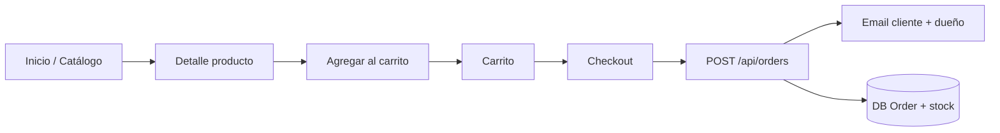

# PRD — Mary Mirari

**Producto:** tienda web de bijouterie y accesorios (collares, pulseras, anillos).  
**Stack actual:** Next.js (App Router), React 19, PostgreSQL (Prisma), Tailwind CSS, Zustand (carrito), Resend y/o SMTP (correo).  
**Versión del documento:** 1.0 (alineado al código del repositorio).

---

## 1. Resumen ejecutivo

Mary Mirari es una **tienda en línea de catálogo + carrito** orientada al mercado argentino. El cliente arma el pedido en la web; el **pago y el envío se coordinan fuera de la plataforma** (transferencia, efectivo, WhatsApp), según el flujo descrito en “Cómo comprar”. El sistema persiste productos y órdenes en base de datos cuando hay catálogo activo, y puede operar en **modo demo** (sin productos en DB) enviando solo correos de resumen.

---

## 2. Problema y oportunidad

- **Problema:** una marca de bijouterie necesita mostrar catálogo, precios y permitir pedidos sin integrar pasarela de pago inmediata.
- **Oportunidad:** reducir fricción con un recorrido claro (catálogo → carrito → datos de envío → confirmación) y notificaciones automáticas por correo al cliente y al negocio.

---

## 3. Objetivos del producto

| Objetivo | Descripción |
|----------|-------------|
| **Visibilidad** | Exhibir productos con imagen, descripción, precio y categoría. |
| **Conversión** | Permitir agregar al carrito, ajustar cantidades y confirmar pedido con datos de envío válidos. |
| **Operación** | Registrar pedidos y stock (cuando aplica) y notificar por email. |
| **Confianza** | Informar el proceso de compra, pagos y arrepentimiento (enlace a información de consumo). |

---

## 4. Usuarios

| Rol | Necesidades principales |
|-----|-------------------------|
| **Visitante / comprador** | Explorar catálogo, filtrar, ver detalle, armar carrito y recibir confirmación por correo. |
| **Dueño / operador** | Recibir pedidos por email, tener órdenes y stock en DB para gestión posterior (fuera de esta app no hay panel admin en código). |

---

## 5. Alcance funcional (implementado)

### 5.1 Sitio público

- **Inicio:** hero de marca, bloques promocionales por categoría, grid de productos destacados (`featured`).
- **Catálogo (`/catalogo`):** listado con filtros por categoría, rango de precio y búsqueda por texto; datos desde DB o fallback coherente con la capa de productos.
- **Ficha de producto (`/catalogo/[slug]`):** detalle, precio, acciones de compra.
- **Carrito (`/carrito`):** líneas persistidas en el cliente (Zustand + persistencia local), cantidades acotadas al stock / máximo permitido.
- **Cómo comprar (`/como-comprar`):** pasos, pagos coordinados post-pedido, bloque de arrepentimiento con enlace oficial.

### 5.2 Carrito y checkout

- Drawer de carrito accesible desde el header (UX de carrito flotante).
- Formulario de checkout: email, teléfono opcional, dirección, ciudad, CP, provincia/estado; país forzado a **Argentina** en backend.
- **Honeypot** anti-bots en el envío del pedido.
- **Idempotencia** opcional (`idempotencyKey`) para evitar órdenes duplicadas y doble descuento de stock.
- Tras confirmación: correos al cliente y al negocio (Resend preferente; SMTP alternativo).

### 5.3 API

- `GET /api/products` — listado con mismos criterios de filtro que el catálogo.
- `POST /api/orders` — creación de pedido con validación Zod, rate limit por IP, validación de stock, transacción de DB y envío de emails.

### 5.4 Datos (Prisma)

- **Product:** slug único, nombre, descripción, precio, imagen, categoría (`COLLAR`, `PULSERA`, `ANILLO`), `featured`, `active`, `stock`.
- **Order** + **OrderItem:** cliente, envío, total, ítems con precio unitario snapshot.

### 5.5 Operaciones y contenido

- Scripts npm: `db:push`, `db:seed`, `db:upsert-products`, `db:clear-products`, `db:import-csv` (y scripts auxiliares en `prisma/` según el repo).
- Botón flotante de **WhatsApp** para contacto (componente dedicado).

---

## 6. Flujos principales

- **Sin productos activos en DB:** el checkout puede operar en **modo demo** con productos de demostración y correos sin persistir orden en DB (comportamiento actual del API).

---

## 7. Requisitos funcionales (priorizados)

| ID | Requisito | Prioridad |
|----|-----------|-----------|
| RF-01 | Listar solo productos `active: true` en venta. | Must |
| RF-02 | Filtrar catálogo por categoría, precio y texto. | Must |
| RF-03 | Mostrar productos destacados en home. | Should |
| RF-04 | Carrito persistente en el navegador del usuario. | Must |
| RF-05 | Validar datos de envío y email en servidor. | Must |
| RF-06 | Rechazar cantidades mayores al stock disponible (modo DB). | Must |
| RF-07 | Descontar stock en transacción atómica al confirmar pedido. | Must |
| RF-08 | Enviar resumen de pedido por correo (cliente y dueño). | Must |
| RF-09 | Limitar frecuencia de `POST /orders` por IP. | Should |
| RF-10 | Página “Cómo comprar” con información legal básica y arrepentimiento. | Should |

---

## 8. Requisitos no funcionales

| Área | Expectativa |
|------|-------------|
| **Rendimiento** | Páginas estáticas/dinámicas según Next; imágenes optimizadas con `next/image` donde aplica. |
| **Seguridad** | Sin secretos en cliente; validación server-side; honeypot; rate limiting básico (consciente de límites en serverless). |
| **Disponibilidad** | Dependiente de Vercel + PostgreSQL + proveedor de email. |
| **i18n** | Contenido principal en español (Argentina). |
| **Accesibilidad** | Mejora continua; formularios y navegación usables en móvil y desktop. |

---

## 9. Variables de entorno relevantes

Definidas en `.env.example`:

- `DATABASE_URL` — PostgreSQL.
- `NEXT_PUBLIC_SITE_NAME`, `NEXT_PUBLIC_SITE_URL` — marca y URL pública.
- `EMAIL_FROM`, `OWNER_EMAIL`, `RESEND_API_KEY` — correo vía Resend.
- `SMTP_*` — alternativa si no se usa Resend.
- `ORDER_EMAIL_CONTACT_NOTE` — texto opcional en el mail al cliente.

---

## 10. Fuera de alcance (estado actual)

- Pasarela de pago en línea (Mercado Pago, Stripe, etc.).
- Cuentas de usuario, login y historial de pedidos del cliente.
- Panel de administración integrado en la web (gestión de productos vía Prisma Studio / scripts / otra herramienta).
- Cálculo automático de envío / integración con correo.
- Multi-moneda o envío internacional explícito (país fijado a Argentina en órdenes).

---

## 11. Métricas de éxito sugeridas

- Tasa de visitas que llegan al carrito y al `POST /api/orders` exitoso.
- Pedidos completados vs. errores 400/409 (stock).
- Entregas de email exitosas vs. fallos en logs.
- Tiempo de carga de catálogo y home en producción.

---

## 12. Riesgos y dependencias

- **Serverless:** el rate limiting en memoria no es global entre instancias; un abuso distribuido puede requerir capa adicional (edge, Redis, etc.).
- **Stock concurrente:** la transacción mitiga condiciones de carrera; mensajes claros al usuario ante conflicto.
- **Resend en sandbox:** con remitente `@resend.dev` las reglas de entrega pueden limitar destinatarios hasta verificar dominio.
- **Base de datos:** sin `DATABASE_URL` en el entorno de deploy, la app no persiste catálogo/órdenes en producción.

---

## 13. Roadmap sugerido (no comprometido)

1. Panel admin mínimo o integración con CMS para productos.  
2. Pagos (link de pago o checkout con MP).  
3. Notificaciones WhatsApp automatizadas al nuevo pedido.  
4. Panel de pedidos para el dueño y estados de orden (pendiente / pagado / enviado).

---

*Este PRD describe el producto tal como está reflejado en el código del repositorio; actualizarlo cuando cambien flujos críticos o el modelo de datos.*
